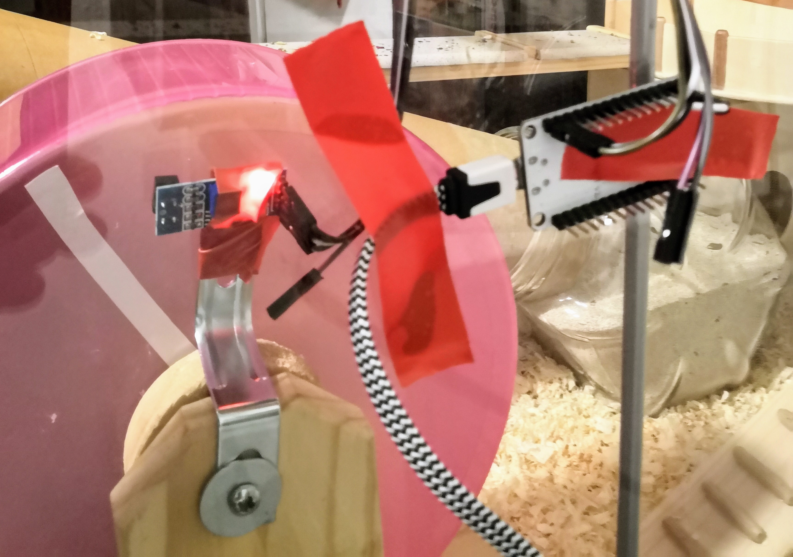

# RunUnoRun
This is a simple hamster fitness tracker I built with my kids. Simlply attach a TCRT5000 infrared trigger module to your hamster wheel, paint a white stripe on it and bingo. You will need a ThingSpeak account to make this work. It will look like [this](https://thingspeak.com/channels/770699). 

# Parts used
* Hamster wheel
* NodeMcu v1.0 - ESP8266
* TCRT5000 module
* Power supply

